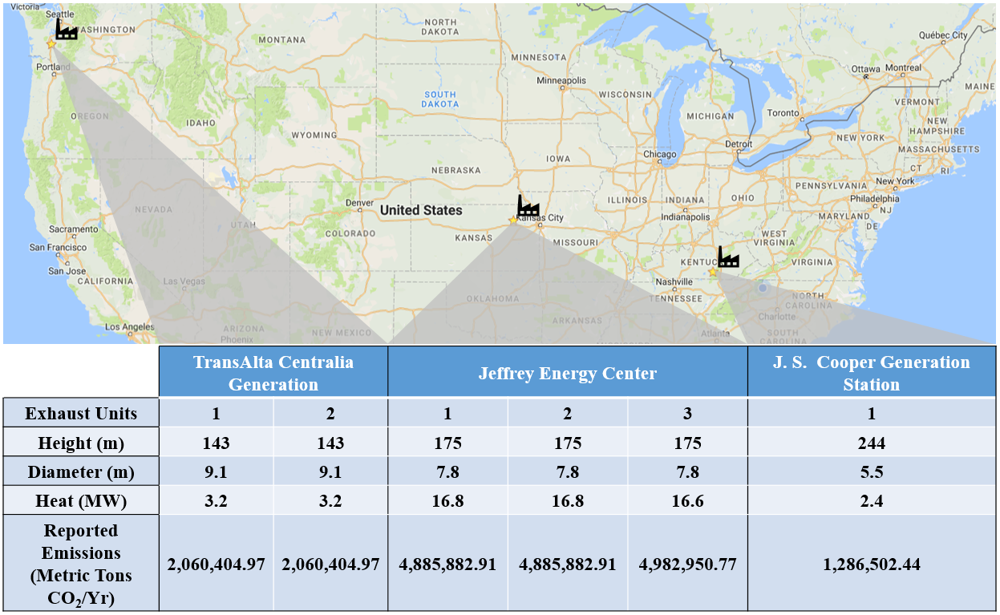

```{r setup, include=FALSE}
knitr::opts_chunk$set(echo = TRUE)
knitr::opts_chunk$set(fig.pos = 'h')
```

# Introduction {-}
During the mid-1800's, the time of the European Industrial Revolution, a connection between the effects of industrial emissions and the global climate was not identified. However, during this period several scientists were suggesting that certain gases found in the atmosphere were more absorptive than others. [@hulme_origin_2009] It wasn't until 1859 that this hypothesis was recognized and strong experimental evidence supported the claim through a series of optical and vacuum chamber tests conducted upon various atmospheric gases as well as the gases emitted from the burning of coal. [@Tyndall1859; -@Tyndall1861] Since then, the International Panel on Climate Change (IPCC) has identified a large body of evidence to further link the effects that Greenhouse Gases (water vapor, carbon dioxide, nitrous oxide, methane, and ozone) have on the global climate. [@IPCC] Although all play a significant role, carbon dioxide ($\mathrm{CO}_2$) accounts for $\mathrm{76}\%$ of all anthropogenic emissions, $\mathrm{65}\%$ of which comes from industrial processes and the burning of fossil fuels. This unprecedented influx of atmospheric $\mathrm{CO}_2$ in relatively recent history has been accurately measured and attributed to significant changes in the Earth's biosphere. [@EPICA; @Keeling; @lopresti_rate_2015]

In the United States alone, the Environmental Protection Agency (EPA) reports that 82% of Greenhouse Gas emissions are $\mathrm{CO}_2$ and 51% of national emissions are generated by electricity production and industrial processes; thus, due to the potential for climatological effects, it is becoming increasingly important to monitor the sources and sinks of the global carbon cycle. In an effort to better understand $\mathrm{CO}_2$ fluxes on a national and global scale, several monitoring schemes have been introduced. These approaches involve ground-based and space-based remote sensing instrumentation as well as high resolution data processing. Such methods include measurements of atmospheric $\mathrm{CO}_2$ at the Mauna Loa Observatory in Hawaii, the Orbiting Carbon Observatory (OCO) and computational methods for improving space-based measurements. [@Keeling; @miller_spectroscopic_2005; @zou_improved_2017] Of these techniques, space-based measurements are most useful in determining the spatial distribution of atmospheric $\mathrm{CO}_2$ as these techniques can provide global, national, and regional measurements of the atmosphere whereas ground-based measurements provide a much lower spatial resolution. The results from these "top-down" measurements of atmospheric $\mathrm{CO}_2$ can be used in climatological and atmospheric inverse modeling applications to determine significant carbon sources and receptors as well as the interactions between them. However, if these space-based measurements are to be validated for atmospheric modeling purposes, additional $\mathrm{CO}_2$ distributions must be generated that can be used to prompt a correlative study of space-based results.

Currently, developed carbon emissions inventories can be used as a foundation for statistical atmospheric $\mathrm{CO}_2$ models yet choices made during the construction of these inventories can significantly affect the results. [@hutchins_comparison_2016; @shih_prediction_2008; @nassar_modeling_2010] The Emission Database for Global Atmospheric Research (EDGAR), Open Source Data Inventory for Anthropogenic $\mathrm{CO}_2$ (ODIAC), and the Vulcan project all use emissions data and locations of known large point sources (coal-fired power plants, cement production facilities, etc) as a proxy for the spatial allocation of $\mathrm{FFCO}_2$ emissions.

Three of the databases that contain relevant information on large point sources include the Emissions & Generation Resource Integrated Database (eGRID), the Greenhouse Gas Reporting Program (GHGRP), and Carbon Monitoring for Action (CarMA) all of which record the yearly emissions and geographic location of the point sources for various years. However, various reported spatial inconsistencies arise for some power plants listed in these databases. [@eGRID; @GHGRP; @CARMA; @hogue_uncertainty_2016] Additionally, measurements of geolocation, height, diameter, and exit velocity of each exhaust stack present are not included in these databases. Although these databases are widely used in both emission inventories and policy development, their exclusion of certain physical parameters make their use as components of atmospheric $\mathrm{CO}_2$ models less routine.

As an argumentative means for the facilitation of more detailed emissions databases, this work presents a methodology for the characterization and comparison of two simulated $\mathrm{CO}_2$ emissions scenarios: one generated strictly from the information contained in the eGRID database and another generated from the inclusion of the point source parameters listed above to demonstrate the sensitivity of the atmospheric model and the role that these parameters have in the characteristics of the dispersion. We consider three power plants from the eGRID database: The Jeffrey Energy Center located in the Emmett Township of Kansas, the John S. Cooper Power Station located near Sumerset, Kentucky, and the TransAlta Centralia power plant located in Washington. Additional analyses are presented using the same methodology to understand the magnitude of impact that each of these parameters have on the model.

# Methodology {-}
## Site Selection {-}
The goal of this work was to develop a method of quantifying the impacts of including various stack parameters (stack height, stack diameter, and exit velocity) in atmospheric models with consideration given to local climates. As shown in *Figure 1*, the diversity of local climate as well as terrain complexity is represented in the three coal-fired power plants selected based on their unique geographic location within the United States: 1) the J. S. Cooper plant is situated near the Central Appalachia region, 2) the Jeffrey Energy Center in Central  Kansas is one of the largest coal-fired power plants in the nation, and 3) the TransAlta Centralia Generating Station located west of Mt. Rainier National Park is also a mountainous region. All three of these power plants are recorded in the 2012 eGRID database with geolocations (latitude and longitude) as well as annual $\mathrm{CO}_2$ emissions. However, as Hogue et. al. demonstrated, the locations reported in emissions databases may differ significantly from the actual geolocation of the point source. For this reason, each power plant was manually located in Google Earth and the number as well as the geolocations of exhaust stacks were recorded.



Stack parameters were gathered from various documentation such as *Best Available Retrofit Technology (BART)* analyses, submitted commercial construction permits and air modeling results. [@noauthor_bart_2008; @noauthor_air_2015; INSERT_CITATION] These values have been assembled in **Table 1** below. When available, individual stack $\mathrm{CO}_2$ emission rates were used; otherwise, the reported eGRID value was used. It should be noted that each stack's net heat is used as a proxy for exit velocity in the following model description.

| **Exhaust Units** | **Height (m)** | **Diameter (m)** | **Heat (MW)**  | **Emissions (Metric Tons $\mathrm{CO}_2$/Yr)**|
|---------------|------------|--------------|------------|-------------------------------------------|
| **TransAlta Centralia Generating**                                                                 |
| 1             | 143        | 9.1          | 3.2        | 2,060,404.97                              |
| 2             | 143        | 9.1          | 3.2        | 2,060,404.97                              |
| **Jeffrey Energy Center**                                                                          |
| 1             | 175        | 7.8          | 16.8       | 4,885,882.91                              |
| 2             | 175        | 7.8          | 16.8       | 4,885,882.91                              |
| 3             | 175        | 7.8          | 16.6       | 4,982,950.77                              |
| **J.S. Cooper Power Generation**                                                                   |
| 1             | 244        | 5.5          | 2.4        | 1,286,502.44                              |

Table: Through various documentation publicly available, the parameters of interest for this work were recorded for each power plant. The number of stacks present as well as each of their locations was determined using Google Earth.

$\pagebreak$

# References {-}